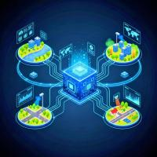
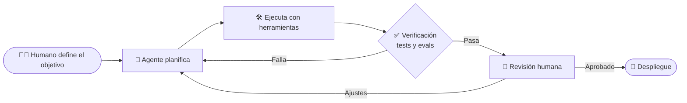
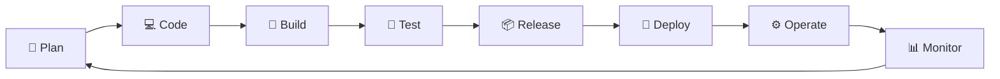

<!-- 👇 Coloca tu logo en assets/logo.png -->

# 🧠 CoreSystems-AI

### *Software agéntico para empresas que quieren funcionar solas*

> **Ayudamos a las empresas a funcionar de forma automática creando sistemas de inteligencia artificial que ejecutan tareas complejas de principio a fin, siempre bajo supervisión humana.**

---

## 🧭 Navegación rápida

---

## 🚀 ¿Quién es CoreSystems-AI?

Somos una empresa de **software agéntico**. Ayudamos a otras empresas a dar el salto de *"usar IA como herramienta"* a **convertirse en organizaciones agénticas**: equipos donde personas y agentes de IA trabajan **mano a mano**, y donde los agentes no solo responden preguntas, sino que **toman un objetivo, lo planifican, lo ejecutan y lo verifican**.

| 🛠️ Herramienta tradicional | 🤖 Sistema agéntico de CoreSystems-AI |
|---|---|
| Espera órdenes | Persigue objetivos |
| Resuelve un paso | Resuelve la tarea completa, de inicio a fin |
| Es estática | Aprende y mejora con cada ciclo |
| Se usa sola | Trabaja codo a codo con el programador |
| Sin control claro | Con permisos, trazabilidad y supervisión humana |

## 🎯 Misión

> Crear programas inteligentes que hagan el trabajo pesado de las empresas por sí solos. En lugar de ser herramientas que solo esperan órdenes, desarrollamos asistentes de IA que resuelven tareas completas de inicio a fin, de forma **rápida, segura y bien coordinada**.

## 🔭 Visión

> Ser los líderes en ayudar a las empresas a operar de manera automática, logrando que las personas y la inteligencia artificial trabajen en equipo con **sistemas seguros que aprenden y mejoran solos**.

---

## 💡 Conceptos clave con los que trabajamos

Estas son las ideas que están definiendo la siguiente generación de software, y que son parte de nuestro día a día:

### 🧰 Harness Engineering
Un modelo de IA por sí solo es solo el "motor". El **harness** es todo lo que lo rodea para que sea confiable en el mundo real: las **herramientas** que puede usar, los **permisos** que tiene, cómo se gestiona su **contexto y memoria**, los **bucles de verificación**, los **sub-agentes** y los **límites de seguridad**. Dos equipos con el mismo modelo pueden obtener resultados completamente distintos; la diferencia está en el harness. **Ahí es donde ponemos nuestra ingeniería.**

### 🧩 Context Engineering
Decidir *qué* información ve el agente, *cuándo* y *en qué formato*. Un agente con el contexto correcto rinde mucho más que uno con un prompt largo y desordenado.

### 🕸️ Orquestación multi-agente
Varios agentes especializados (planificador, ejecutor, revisor, auditor de seguridad) coordinados como un equipo, cada uno con su rol y sus herramientas.

### 🔌 MCP (Model Context Protocol)
Un estándar abierto para conectar agentes con sistemas de la empresa (bases de datos, APIs, repositorios, herramientas internas) de forma ordenada y controlada.

### ✅ Evals y bucles de verificación
Los agentes no se "creen" sin medir. Usamos pruebas automáticas, evaluaciones y revisión cruzada para comprobar que cada resultado es correcto antes de que llegue a producción.

### 🙋 Human-in-the-Loop
La autonomía total no es el objetivo; la **autonomía supervisada** sí. Las acciones sensibles pasan por aprobación humana, y todo queda registrado y es auditable.

### 🛡️ Guardrails y defensa contra prompt injection
Límites técnicos que impiden que un agente haga lo que no debe, incluso si alguien intenta engañarlo con instrucciones maliciosas escondidas en un documento o una página web.

### 🔁 Sistemas que aprenden y mejoran
Cada ejecución deja datos: qué funcionó, qué falló, qué se corrigió. Esa retroalimentación alimenta la mejora continua del sistema.

---

## 🤝 Cómo trabaja un agente junto al programador

El programador deja de escribir cada línea y pasa a **dirigir, revisar y decidir**. El agente se encarga del trabajo repetitivo y pesado. El resultado: **más velocidad sin perder control**.

---

## ♾️ Metodología DevOps (y DevSecOps)

Trabajamos con **DevOps** como columna vertebral: ciclos cortos, automatización de punta a punta y feedback constante. La seguridad no es una fase final; está presente en **todas** las etapas (**DevSecOps**). Los agentes de IA participan en cada fase, siempre con un humano responsable.

| Fase | Qué pasa | Rol de los agentes | Supervisión humana |
|---|---|---|---|
| 📝 **Plan** | Se definen objetivos y diseño | Analizan requisitos y proponen planes | Arquitectura valida |
| 💻 **Code** | Se escribe el código | Generan y refactorizan código | Revisión de *pull requests* |
| 🔨 **Build** | Se compila y empaqueta | Pipelines CI automatizados | Equipo de backend |
| 🧪 **Test** | Se prueba todo | Crean y ejecutan pruebas y evals | QA y seguridad |
| 📦 **Release** | Se prepara la versión | Generan notas y verifican cambios | Aprobación final |
| 🚀 **Deploy** | Se publica | Despliegue con Infraestructura como Código | Aprobación en acciones críticas |
| ⚙️ **Operate** | Se opera el sistema | Resuelven incidentes rutinarios | Escalamiento a humanos |
| 📊 **Monitor** | Se observa y se aprende | Detectan anomalías y proponen mejoras | Retroalimentación al plan |

---

## 👥 Nuestro equipo

Cada integrante aporta su punto de vista y su "granito de arena" para que los sistemas agénticos sean **bien diseñados, seguros, rápidos y agradables de usar**. Cada rol se apoya en **normas ISO** como referencia de calidad.

---

## 🏗️ Arquitecto de Software

<table>
<tr>
<td width="220" align="center">
<!-- 👇 Reemplaza con la foto real: assets/team/carlos-sanchez.jpg -->

 <b>Carlos Sánchez</b>
 <i>Arquitecto de Software</i>
</td>
<td>

**👁️ Punto de vista:** *"Un agente poderoso sin una buena arquitectura es solo un riesgo rápido. Diseñamos primero la estructura, luego la autonomía."*

**🧱 Su aporte:**
- Diseña la arquitectura global del sistema agéntico y el **harness** que rodea a los agentes.
- Define cómo se comunican los agentes, las herramientas y los servicios (incluyendo integraciones tipo MCP).
- Decide límites de autonomía, puntos de aprobación humana y estrategias de escalabilidad.
- Documenta decisiones técnicas (ADRs) para que el equipo avance alineado.

**♾️ En DevOps:** lidera las fases de **Plan** y **Code**, y valida el diseño antes de cada release.

**📜 ISOs representativas:**

| Norma | Para qué la usamos |
|---|---|
| **ISO/IEC/IEEE 42010** | Descripción y documentación de arquitectura |
| **ISO/IEC 25010** | Modelo de calidad del software (fiabilidad, mantenibilidad, rendimiento) |
| **ISO/IEC/IEEE 12207** | Procesos del ciclo de vida del software |

</td>
</tr>
</table>

---

## 🛡️ Seguridad

<table>
<tr>
<td width="220" align="center">
<!-- 👇 Reemplaza con la foto real: assets/team/alex-santiago.jpg -->

 <b>Alex Santiago</b>
 <i>Seguridad</i>
</td>
<td>

**👁️ Punto de vista:** *"Cuanta más autonomía le damos a un agente, más importante es que cada acción sea controlada, trazable y reversible."*

**🔐 Su aporte:**
- Define permisos mínimos, sandboxing y **guardrails** para cada agente.
- Protege contra *prompt injection*, fuga de datos y uso indebido de herramientas.
- Integra seguridad en el pipeline (**DevSecOps**): análisis de código, dependencias y secretos.
- Establece registros de auditoría para saber qué hizo cada agente y por qué.

**♾️ En DevOps:** presente en **todas las fases**, con foco especial en **Test**, **Deploy** y **Monitor**.

**📜 ISOs representativas:**

| Norma | Para qué la usamos |
|---|---|
| **ISO/IEC 27001** | Sistema de gestión de seguridad de la información |
| **ISO/IEC 27002** | Controles y buenas prácticas de seguridad |
| **ISO/IEC 42001** | Sistema de gestión de inteligencia artificial responsable |
| **ISO/IEC 27034** | Seguridad en las aplicaciones |

</td>
</tr>
</table>

---

## 🗄️ Base de Datos

<table>
<tr>
<td width="220" align="center">
<!-- 👇 Reemplaza con la foto real: assets/team/aaron-robles.jpg -->

 <b>Aaron Robles</b>
 <i>Base de Datos</i>
</td>
<td>

**👁️ Punto de vista:** *"Los agentes son tan buenos como los datos y la memoria que reciben. Datos limpios, bien modelados y seguros igual a decisiones confiables."*

**💾 Su aporte:**
- Modela y optimiza las bases de datos que alimentan a los agentes.
- Diseña la **memoria persistente** y el almacenamiento de contexto (incluyendo búsqueda semántica cuando aplica).
- Garantiza integridad, respaldos, rendimiento y calidad de los datos.
- Gestiona migraciones de esquema como parte del pipeline de despliegue.

**♾️ En DevOps:** participa en **Code**, **Build** y **Deploy** (migraciones automatizadas) y en **Monitor** (rendimiento).

**📜 ISOs representativas:**

| Norma | Para qué la usamos |
|---|---|
| **ISO/IEC 9075** | Estándar del lenguaje SQL |
| **ISO/IEC 25012** | Modelo de calidad de datos |
| **ISO 8000** | Calidad e integridad de datos |
| **ISO/IEC 27701** | Gestión de privacidad de la información |

</td>
</tr>
</table>

---

## ⚙️ Backend

<table>
<tr>
<td width="220" align="center">
<!-- 👇 Reemplaza con la foto real: assets/team/juan-cueva.jpg -->

 <b>Juan Cueva</b>
 <i>Backend</i>
</td>
<td>

**👁️ Punto de vista:** *"El backend es el cerebro operativo: aquí los agentes se conectan con el mundo real mediante APIs, herramientas y flujos bien orquestados."*

**🧠 Su aporte:**
- Construye la lógica de negocio, las APIs y los servicios que usan los agentes.
- Implementa el **harness** en código: bucles de agente, herramientas, colas de tareas y orquestación.
- Escribe pruebas automáticas y *evals* para verificar el comportamiento de los agentes.
- Revisa el código generado por agentes antes de integrarlo.

**♾️ En DevOps:** protagonista en **Code**, **Build** y **Test**, con integración y entrega continuas (CI/CD).

**📜 ISOs representativas:**

| Norma | Para qué la usamos |
|---|---|
| **ISO/IEC 25010** | Calidad del producto de software |
| **ISO/IEC/IEEE 29119** | Pruebas de software |
| **ISO/IEC/IEEE 12207** | Procesos del ciclo de vida |
| **ISO/IEC 5338** | Ciclo de vida de sistemas de IA |

</td>
</tr>
</table>

---

## 🖥️ Frontend

<table>
<tr>
<td width="220" align="center">
<!-- 👇 Reemplaza con la foto real: assets/team/jean-pool.jpg -->

 <b>Jean Pool</b>
 <i>Frontend</i>
</td>
<td>

**👁️ Punto de vista:** *"La interfaz es donde el humano supervisa al agente. Debe mostrar qué está haciendo, por qué, y permitir intervenir en cualquier momento."*

**🖥️ Su aporte:**
- Convierte los diseños de UI/UX en interfaces rápidas, responsivas y accesibles.
- Construye paneles de control para **ver, aprobar, pausar o corregir** a los agentes en tiempo real.
- Muestra el progreso, los resultados y el historial de acciones de forma clara.
- Optimiza rendimiento y compatibilidad entre dispositivos.

**♾️ En DevOps:** activo en **Code**, **Build**, **Test** (pruebas de interfaz) y **Deploy**.

**📜 ISOs representativas:**

| Norma | Para qué la usamos |
|---|---|
| **ISO/IEC 40500 (WCAG)** | Accesibilidad web |
| **ISO/IEC 25010** | Usabilidad y eficiencia de uso |
| **ISO 9241-11** | Usabilidad: efectividad, eficiencia y satisfacción |

</td>
</tr>
</table>

---

## 🎨 UI/UX

<table>
<tr>
<td width="220" align="center">
<!-- 👇 Reemplaza con la foto real: assets/team/luis-aguilar.jpg -->

 <b>Luis Aguilar</b>
 <i>UI/UX</i>
</td>
<td>

**👁️ Punto de vista:** *"Una IA poderosa que nadie entiende no sirve. Diseñamos para que trabajar con agentes se sienta natural, transparente y confiable."*

**✏️ Su aporte:**
- Investiga a los usuarios y diseña experiencias centradas en las personas.
- Diseña la **confianza**: cómo se comunica el agente, cómo pide aprobación y cómo explica sus decisiones.
- Define el sistema de diseño, la identidad visual y los prototipos.
- Valida con usuarios reales y retroalimenta el ciclo de mejora.

**♾️ En DevOps:** lidera **Plan** (descubrimiento y diseño) y aporta en **Monitor** (feedback de uso real).

**📜 ISOs representativas:**

| Norma | Para qué la usamos |
|---|---|
| **ISO 9241-210** | Diseño centrado en el ser humano |
| **ISO 9241-11** | Medición de usabilidad |
| **ISO 9241-110** | Principios de interacción persona-sistema |

</td>
</tr>
</table>

---

## 🌟 ¿Por qué CoreSystems-AI?

- 🧰 **Ingeniería de harness:** no solo conectamos un modelo; construimos el sistema que lo hace confiable.
- 🙋 **Humano siempre en control:** autonomía supervisada, auditable y reversible.
- 🛡️ **Seguridad desde el diseño:** DevSecOps y alineación con normas ISO.
- 🤝 **Equipo completo:** arquitectura, seguridad, datos, backend, frontend y experiencia de usuario bajo un mismo techo.
- 📈 **Mejora continua:** sistemas que aprenden de cada ejecución.

---

## 📬 Contacto

| | |
|---|---|
| 🌐 **Web** | _(próximamente)_ |
| ✉️ **Correo** | _contacto@coresystems-ai.com_ |
| 💼 **LinkedIn** | _(agregar enlace)_ |

**¿Eres inversor o empresa interesada en volverte agéntica?** Escríbenos; construyamos juntos el futuro del trabajo.

 

**CoreSystems-AI** · *Personas + IA, trabajando en equipo.*

